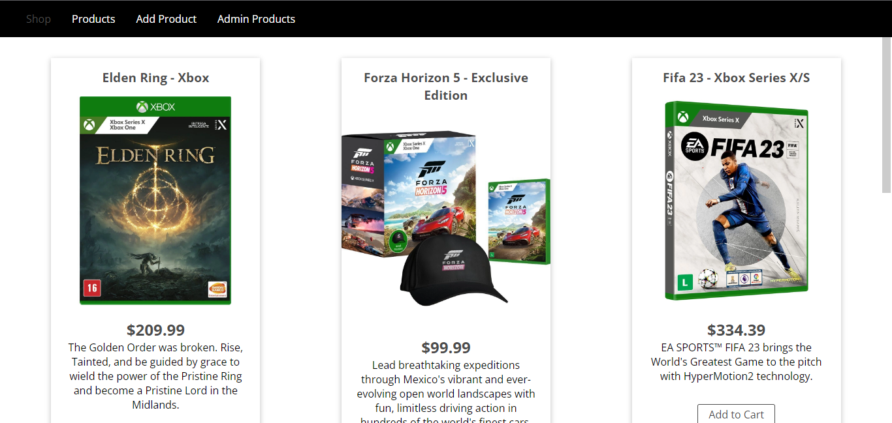
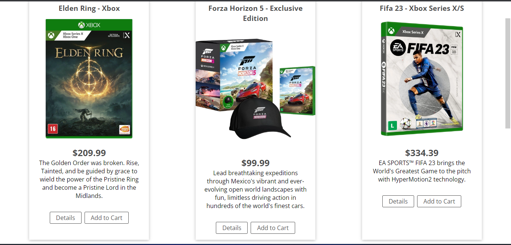
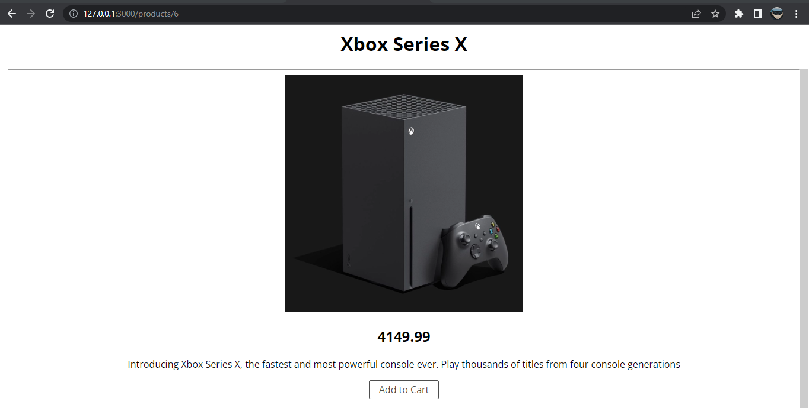
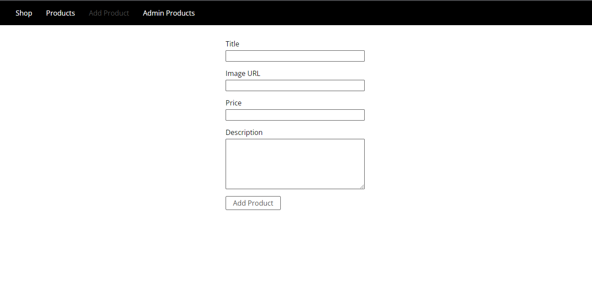
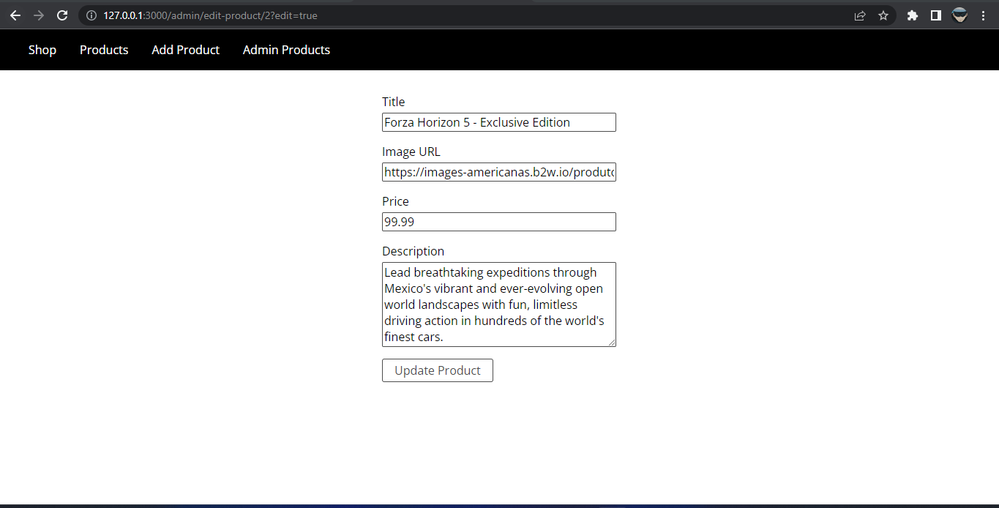

# gm-store

## This project was based on a [Node.js](https://www.udemy.com/course/nodejs-the-complete-guide/) course on Udemy

Tools used: 
<ul>
<li>Express</li>
<li>EJS</li>
<li>MySQL</li>
<li>DOTENV</li>
</ul>

## How works:

### Shop:

# 

### Products Page:

#

### Product Details:

#

### Add Product:

#

### Admin Product:

#

### Editing Product:

